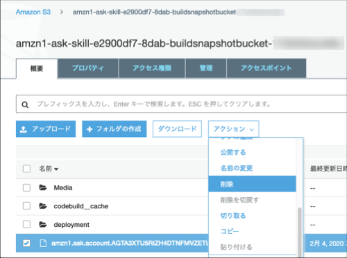

# Alexaスキル「コーヒーショップ」


日本向けのAlexaスキル開発の学習教材「Alexa道場」で作成しているサンプルコード「コーヒーショップ」のソースコードを提供するためのリポジトリです。

## Alexa道場
Alexaスキル開発の基礎から学べるセルフラーニングのビデオ教材です。この教材は、”シンプルなカスタムスキルなら自分で作れるようになる”ところまでを目標としています。そのために必要な知識、用語、プログラミング方法を1つ１つ学べるよう設計されています。トピック毎に5-10分程度の長さに区切られているので、必要なトピックだけを選択して学習することもできます。

## シーズン1 はじめてのAlexaスキル開発

このシーズンでは、Alexa開発者コンソールが提供するHello Worldスキルのテンプレートを使用します。
ビデオの手順通りに進めていくと、お手持ちのAlexa搭載デバイスでHello World スキルをテストすることができるようになります。コーヒーショップスキルを作り始める前に、Alexaスキル開発に必要なアカウントやツールへのアクセス方法を学びます。まずはここから始めることをお勧めします。

[](https://www.youtube.com/playlist?list=PLan9XPu5-9zzR7dDKOO_bdrMT5ppbjm1S)

#### 参考リソース

 * [スキル開発の要件](https://developer.amazon.com/ja-JP/docs/alexa/ask-overviews/requirements-to-build-a-skill.html)
 * [初めてのスキル開発](https://developer.amazon.com/ja-JP/docs/alexa/alexa-skills-kit-sdk-for-nodejs/develop-your-first-skill.html)  


## シーズン2 Alexaスキル開発の基礎を学ぼう

シーズン2では、テンプレートをベースに、**コーヒーの注文を受け付ける**シンプルなカスタムスキル「**コーヒーショップ**」スキルを作成します。以下のトピックが含まれます。

- カスタムスキルを作る手順のデモ
- 対話モデル、インテントなどの基礎用語
- ASK SDKを使った基本的なJavaScriptコードの書き方

[](https://www.youtube.com/watch?v=9BaBTmwqRcU&list=PLan9XPu5-9zx-p7tJrjPAlMFvyELIck6t)

#### シーズン2で完成するスキルのビルド方法
1. Alexa開発コンソールの「ビルド」タプの画面を開き、左側パネルからJSONエディターを開き、コードエディター部にGitHubの [Season2](./Season2)フォルダーの[ja-JP.json](./Season2/ja-JP.json)ファイルの中身を全てコピーします。
2. JSONコードを保存し、対話モデルをビルドします。
3. Alexa開発コンソールの「コードエディタ」タプの画面を開き、GitHubの [Season2](./Season2)フォルダーの[index.js](./Season2/index.js)ファイルの中身を全てコピーします。
4. JavaScriptコードを保存&デプロイします。
5. Alexa開発コンソールの「テスト」タプをクリックし、Alexaシミュレーターで動作を確認します。

#### 参考リソース

* [カスタムスキルの呼び出し名を決定する](https://developer.amazon.com/ja-JP/docs/alexa/custom-skills/choose-the-invocation-name-for-a-custom-skill.html)
* [リクエスト処理](https://developer.amazon.com/ja-JP/docs/alexa/alexa-skills-kit-sdk-for-nodejs/handle-requests.html)
* [応答のビルド](https://developer.amazon.com/ja-JP/docs/alexa/alexa-skills-kit-sdk-for-nodejs/build-responses.html)


## シーズン3 スロットを使いこなそう

シーズン3では、シーズン2で作成した「コーヒーショップ」スキルに、スロットの機能を使って、ユーザーがコーヒーの種類と数量を指定できるように改良を加えます。以下のトピックが含まれます。

- スキルにスロットを導入する
- 同義語(シノニム)とエンティティ解決を使いこす

[](https://www.youtube.com/watch?v=uO3CWILZA0c&list=PLan9XPu5-9zwvLFiCZngEgL5Ba0n83gb8)

#### シーズン3で完成するスキルのビルド方法
1. Alexa開発コンソールの「ビルド」タブの画面を開き、左側パネルからJSONエディターを開き、コードエディター部にGitHubの [Season3](./Season3)フォルダーの[ja-JP.json](./Season3/ja-JP.json)ファイルの中身を全てコピーします。
2. JSONコードを保存し、対話モデルをビルドします。
3. Alexa開発コンソールの「コードエディタ」タプの画面を開き、GitHubの [Season3](./Season3)フォルダーの[index.js](./Season3/index.js)ファイルの中身を全てコピーします。
4. JavaScriptコードを保存&デプロイします。
5. Alexa開発コンソールの「テスト」タプをクリックし、Alexaシミュレーターで動作を確認します。

#### 参考リソース

* [インテント、発話、スロットの作成](https://developer.amazon.com/ja-JP/docs/alexa/custom-skills/create-intents-utterances-and-slots.html)
* [スロットタイプリファレンス](https://developer.amazon.com/ja-JP/docs/alexa/custom-skills/slot-type-reference.html)
* [カスタムスロットタイプの作成と編集](https://developer.amazon.com/ja-JP/docs/alexa/custom-skills/create-and-edit-custom-slot-types.html)
* [スロットタイプ値の同義語とIDを定義する(エンティティ解決)](https://developer.amazon.com/ja-JP/docs/alexa/custom-skills/define-synonyms-and-ids-for-slot-type-values-entity-resolution.html)
* [サンプル発話とカスタムスロットタイプの値を作成する際のベストプラクティス](https://developer.amazon.com/ja-JP/docs/alexa/custom-skills/best-practices-for-sample-utterances-and-custom-slot-type-values.html)


## シーズン4 記憶：人間の会話に近づけよう

シーズン4では、シーズン3で作成した「コーヒーショップ」スキルをさらに改良して、会話中にユーザーから取得した情報や、前回の会話の内容を記憶するしくみを導入します。これを実現するために以下のテクニックを習得します。

- セッションアトリビュート
- 永続アトリビュート

[](https://www.youtube.com/watch?v=uO3CWILZA0c&list=PLan9XPu5-9zwvLFiCZngEgL5Ba0n83gb8)

#### シーズン4で完成するスキルのビルド方法
1. Alexa開発コンソールの「ビルド」タプの画面を開き、左側パネルからJSONエディターを開き、コードエディター部にGitHubの [Season4](./Season4)フォルダーの[ja-JP.json](./Season4/ja-JP.json)ファイルの中身を全てコピーします。
2. JSONコードを保存し、対話モデルをビルドします。
3. Alexa開発コンソールの「コードエディタ」タプの画面を開き、GitHubの [Season4](./Season4)フォルダーの[index.js](./Season4/index.js)ファイルの中身を全てコピーし保存します。
4. さらに、 [Season4](./Season4)フォルダーの[package.json](./Season4/package.json)ファイルの中身を全てコピーし、コードエディタの左パネルにあるpackage.jsonの中身を置き換えて保存します。または、以下のようにオリジナルのpackage.jsonを編集して、` "dependencies"`のグループに`"ask-sdk-s3-persistence-adapter": "^2.0.0"` のエントリーを追加しても構いません。

```package.json
 "dependencies": {
    "ask-sdk-core": "^2.7.0",
    "ask-sdk-model": "^1.18.0",
    "aws-sdk": "^2.326.0",
    "ask-sdk-s3-persistence-adapter": "^2.0.0"
  }
```

5. 全てのコードの編集が終わったらコードを保存&デプロイします。
6. Alexa開発コンソールの「テスト」タプをクリックし、Alexaシミュレーターで動作を確認します。

- 永続アトリビュートに保存された情報をリセットし初期状態に戻したい場合は、S3に保存されている下の図のファイルを削除してください。ファイル名=ユーザーIDとなっています。異なるユーザーでテストした場合は、テストしたユーザーの数だけファイルが生成されますので注意してください。

 

#### 参考リソース
* [アトリビュートの管理](https://developer.amazon.com/ja-JP/docs/alexa/alexa-skills-kit-sdk-for-nodejs/manage-attributes.html)


## 追加のリソース

### ドキュメント

* [Alexa Skills Kit Node.js SDK](https://www.npmjs.com/package/ask-sdk) - Alexa Skills Kit SDK for Node.js の公式ドキュメント

*  [Alexa Skills Kit Documentation](https://developer.amazon.com/docs/ask-overviews/build-skills-with-the-alexa-skills-kit.html) - Alexa Skills Kit の技術文書

### コミュニティ
* [Amazon 開発者フォーラム(日本語)](https://forums.developer.amazon.com/spaces/293/index.html) - Alexaのスキル開発でわからないことがあればこちらに投稿し、Alexaコミュニティからのアドバイスをもらうことができます。

* [Alexa 開発者ポータル](https://alexa.design) - Alexaに関する全ての情報にアクセスできるポータルサイト。


